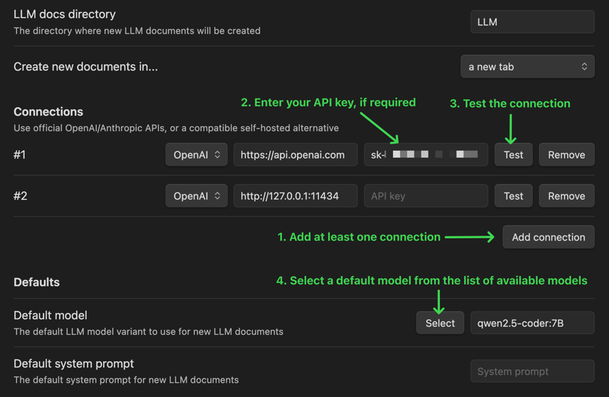
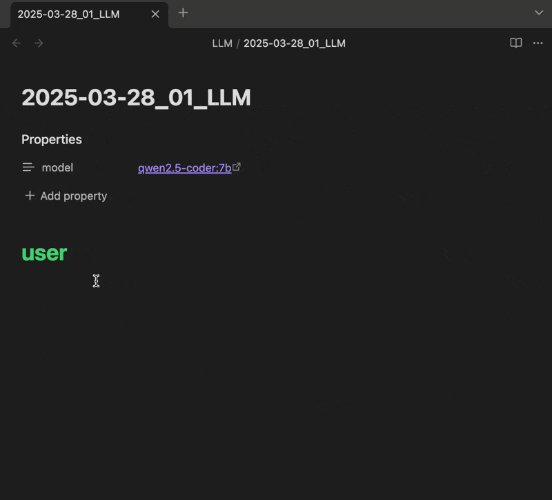

# Obsidian LLM docs

A plugin for Obsidian (https://obsidian.md) that lets you chat with LLMs in plain markdown files!

## Features

- Use the same Obsidian markdown editor you know and love to chat with LLMs and freely edit conversation history
- Integrates with the OpenAI API
- Also works with self-hosted/local LLMs that expose an OpenAI-compatible API, like Ollama (https://ollama.com)
- Can follow links to other Obsidian documents included in your prompt, making it easier to include additional context
- Supports linked/embedded images in prompt

## How to use

### 1. Update your configuration

Open the Obsidian settings window and select "LLM docs" under "Community plugins":

### 2. Create an LLM document

Create a new document by clicking the LLM docs icon (looks like a robot) in the sidebar, or running the "Create new LLM document" command (use it from the command palette, or assign a keyboard shortcut)

### 3. Prompt the LLM

Type in your prompt and click "Complete" to generate a response! (or bind a keyboard shortcut)

## If you like it, I'm grateful for your support!

